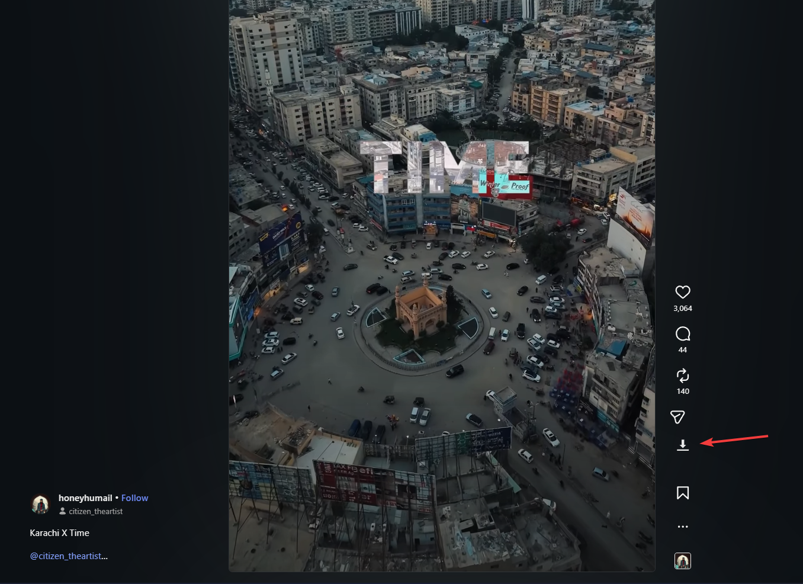

# InstaMediaAssist

InstaMediaAssist is a lightweight and efficient browser extension designed to help you download high-quality media from Instagram with ease. It integrates seamlessly into the Instagram web interface, providing a direct download button for images, videos, reels, and carousel posts.

## Features

- High Quality Downloads: Automatically identifies and retrieves the highest resolution available for both images and videos.
- Seamless UI Integration: Adds a discreet download button next to the share icon on every post and reel.
- Carousel Support: Detects and downloads all items within a carousel (sidecar) post in one click.
- Smart Filenaming: Saves files with clear, descriptive names using the format: username-postID.extension.
- Real-time Interception: Uses advanced network interception to capture media metadata directly from Instagram's internal API, ensuring accuracy and speed.
- Privacy Focused: No external servers or analytics. All processing happens locally in your browser.

## Demo

## Supported Media Types

- Single Image Posts
- Single Video Posts
- Instagram Reels
- Carousel Posts (Images and Videos)

## Installation

### For Developers (Manual Load)

1. Download or clone this repository to your local machine.
2. Open your browser's Extensions page:
   - Chrome: Navigate to `chrome://extensions`
   - Edge: Navigate to `edge://extensions`
3. Enable "Developer mode" using the toggle in the top-right corner.
4. Click "Load unpacked" and select the `InstaMediaAssist` folder from this repository.
5. Instagram should now display download buttons on posts.

## How to Use

1. Navigate to any Instagram post or reel.
2. Look for the download icon (downward arrow) located next to the share/direct icon.
3. Click the icon to start the download.
4. For carousel posts, the extension will automatically download all media associated with that post.

Note: If a download fails or the icon is not appearing, try refreshing the page or scrolling slightly to ensure the media metadata has been loaded by Instagram.

## Permissions Explained

- storage: Used to manage internal configurations and temporary state.
- downloads: Required to save the media files directly to your default downloads folder.
- scripting: Necessary for injecting the interface elements and intercepting media metadata safely.
- Host Permissions (*://*.instagram.com/*): Allows the extension to function only on the Instagram website.

## Disclaimer

This extension is for personal use only. Please respect the copyright of content creators and Instagram's terms of service. Do not redistribute downloaded content without permission from the original owner.

